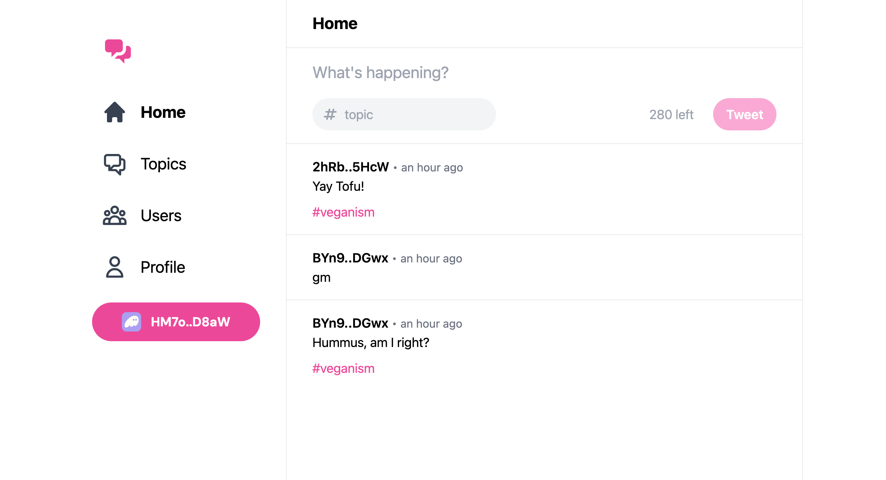

# Solana Twitter



## General Info

This is a modern version of a popular [solana-twitter](https://lorisleiva.com/create-a-solana-dapp-from-scratch)
app, made in 2021 by **Loris Leiva**. For some reason, the author
no longer updates this series of articles, so it is now outdated.

So I did some work to bring the project back to life.
This work includes:

- migrating to newer / safer versions of libraries used
- minor bug and logic fixes
- updating code to the latest version of Anchor (0.30 and newer).

Feel free to examine and learn something new. If this helps you,
please don't forget to give me a star on GitHub.

*If you see any mistakes or errors - please open a PR.*

## Project Demo

Please, visit a [demo](https://twitter-dapp-uandere.netlify.app/#/).

## Episodic Notes

### Episode 4

First of all, you can staight away change the `SendTweet` struct
to this:

```rust
#[derive(Accounts)]
pub struct SendTweet<'info> {
    #[account(init, payer = author, space = Tweet::LEN)]
    pub tweet: Account<'info, Tweet>,
    #[account(mut)]
    pub author: Signer<'info>,
    pub system_program: Program<'info, System>,
}
```

Using more specific fields will put more constraints and will be
much better in terms of ergonomics than using Rust attributes.

If you're getting errors concerning **safety checks**, proceed to
[this](https://www.anchor-lang.com/docs/the-accounts-struct#safety-checks)
doc page.

When handling errors, use `err!()` macro instead of `Err(<>.into())`:

```diff
if topic.chars().count() > 50 {
-    return Err(ErrorCode::TopicTooLong.into())
+    return err!(ErrorCode::TopicTooLong);
}

if content.chars().count() > 280 {
-    return Err(ErrorCode::ContentTooLong.into())
+    return err!(ErrorCode::ContentTooLong);
}
```

### Episode 5

Make sure you don't use `@project-serum/anchor` library (which is
outdated), but `@coral-xyz/anchor` instead. If you don't, you will
stumble across millions of stupid warnings and errors.

When catching errors in the last few tests, use `error.error.errorMessage`
instead of `error.msg`, as it is outdated too.

### Episode 6

This note right in the beginning...:

> This applies for Apple M1 users that have to run
solana-test-validator --no-bpf-jit --reset and anchor
test --skip-local-validator instead of anchor test.
Just make sure you restart your local ledger before
running the tests every time.

...is in fact outdated.

The only true and unified way (as of now) to run the tests is using
`anchor test`.

### Episode 7

This is where things are becoming shitty. I will note everything you
need step by step (using author's titles):

#### Install Vue CLI

Just use [official Vue installation manual](https://cli.vuejs.org/guide/installation.html).

#### Create a new Vue app

Do as it is written in the original article.

#### Install Solana and Anchor libraries

**Again, you should install `@coral-xyz/anchor`,
NOT `@project-serum/anchor`!**

```sh
npm install @solana/web3.js @project-serum/anchor
```

#### Configure node polyfills

Remove all code from `config.vue.js`. Insert this:

```js
const webpack = require('webpack')
const { defineConfig } = require('@vue/cli-service')

module.exports = defineConfig({
    transpileDependencies: true,
    configureWebpack: {
        plugins: [
            new webpack.ProvidePlugin({
                Buffer: ['buffer', 'Buffer']
            })
        ],
        resolve: {
            fallback: {
                crypto: false,
                fs: false,
                assert: false,
                process: false,
                util: false,
                path: false,
                stream: require.resolve('stream-browserify'),
                http: require.resolve('stream-http'),
                https: require.resolve('https-browserify'),
                zlib: require.resolve('browserify-zlib'),
                url: require.resolve('url/'),
            }
        }
    }
})
```

#### Configure ESLint

Do as it is.

#### Install TailwindCSS

Do as it is.

#### Install Vue Router

Do as it is.

#### Copy/paste some files

Do as it is to the end of the episode.

### Episode 8

In this episode, you should simply use `AnchorProvider` instead of
`Provider` object while initializing workspace:

```js
import { computed } from 'vue'
import { useAnchorWallet } from 'solana-wallets-vue'
import { Connection, PublicKey } from '@solana/web3.js'
import { AnchorProvider, Program } from '@project-serum/anchor'
import idl from '../../../target/idl/solana_twitter.json'

const programID = new PublicKey(idl.metadata.address)
let workspace = null

export const useWorkspace = () => workspace

export const initWorkspace = () => {
    const wallet = useAnchorWallet()
    const connection = new Connection('http://127.0.0.1:8899')
    const provider = computed(() => new AnchorProvider(connection, wallet.value))
    const program = computed(() => new Program(idl, programID, provider.value))

    workspace = {
        wallet,
        connection,
        provider,
        program,
    }
}
```

In fact, we should change something too in this piece of code later
(of course, if you want it to work 😅). But I will leave this as it
is to the next episode note.

### Episode 9

Before you try to do something in this episode: **Don't forget to run
`solana-test-validator` to start the local ledger and
`anchor run test` to get access to the tweets from the tests!**

Honestly, for me, it was a challenge to get things done here. For
some reason, I was constantly getting the exact same error:

```diff
index.js:5065 Uncaught (in promise) TypeError: Cannot read properties of undefined (reading 'size')
    at new AccountClient (index.js:5065:39)
    at eval (index.js:5030:30)
    at Array.reduce (<anonymous>)
    at AccountFactory.build (index.js:5029:70)
    at NamespaceFactory.build (index.js:6219:51)
    at new Program (index.js:6320:97)
    at eval (useWorkspace.js:16:1)
    at ReactiveEffect.eval [as fn] (reactivity.esm-bundler.js:987:44)
    at ReactiveEffect.run (reactivity.esm-bundler.js:238:19)
    at get value (reactivity.esm-bundler.js:994:147)
```

However, these are the changes to the original episode that will do
the job:

File: `useWorkspase.js`

```diff
- new Program(idl, programID, provider.value));
+ new Program(idl, provider.value));
```

As it turns out, the constructor of the `Program` class has changed,
and you can find the details of that changes in Anchor's CHANGELOG.
And it is pretty logical action to do: since we're already passing in `idl`, why would we pass the field of `idl` as well?

The rest of the episode is pretty straightforward, although if you
will go by the author's order, you will first get an error when
clicking on a timestamp link. But he handles it at the end of the
episode, so just follow him.

### Episode 10

Again and again, use `@coral-xyz/anchor` when changing
`send-tweet.js`.

Next, if you tried to set the commitment level as author did, you will get an error:

```diff
Error: Simulation failed. Message: Transaction simulation failed: Blockhash not found.
```

The thing is: the rules that describe how and where to specify commitment levels had changed.
So that is our code:

File: `useWorkspace.js`:

```js
import { computed } from "vue";
import { useAnchorWallet } from "solana-wallets-vue";
import { Connection } from "@solana/web3.js";
import { AnchorProvider, Program } from "@coral-xyz/anchor";
import idl from '@/idl/solana_twitter.json'

const clusterUrl = process.env.VUE_APP_CLUSTER_URL

let workspace = null;
export const useWorkspace = () => workspace;

const preflightCommitment = 'confirmed'
const commitment = 'confirmed'

export const initWorkspace = () => {
  const wallet = useAnchorWallet();
  console.log(clusterUrl);
  // Specifying default commitment for connection
  const connection = new Connection(clusterUrl, commitment);
  // Specifying default preflightCommitment for AnchorProvider, which is enough for our application
  const provider = computed(() => new AnchorProvider(connection, wallet.value, { preflightCommitment })); 
  const program = computed(() => new Program(idl, provider.value));

  
  workspace = {
    wallet,
    connection,
    provider,
    program,
  };
};
```

File: `send-tweet.js`:

```js
import { web3 } from "@coral-xyz/anchor";
import { useWorkspace } from "@/composables";
import { Tweet } from "@/models";

export const sendTweet = async (topic, content) => {
  const { wallet, program } = useWorkspace();

  const tweet = web3.Keypair.generate();
  
  // Using RPC builder-sryle call.
  // This will use our commitment levels, previously set in `AnchorProvider` and `Connection`
  await program.value.methods
    .sendTweet(topic, content)
    .accounts({
      author: wallet.value.publicKey,
      tweet: tweet.publicKey,
      systemProgram: web3.SystemProgram.programId,
    })
    .signers([tweet])
    .rpc();

  const tweetAccount = await program.value.account.tweet.fetch(tweet.publicKey);

  return new Tweet(tweet.publicKey, tweetAccount);
};
```

### Episode 11

Later, if you get some erros while trying to airdrop some Solana to your Phantom Wallet
(as I did), you could use [Helius](`https://www.helius.dev/`) RPC instead of default Solana's devnet.
It is pretty staighforward to do, so I just redirect you to the [Solana docs page](https://solana.com/developers/guides/getstarted/solana-token-airdrop-and-faucets#3-rpc-provider-faucets).

You could aslo use a [web version](https://faucet.solana.com/) of Solana faucet.

Ok, so that's it! The rest of the episode should be crystal clear and working.
